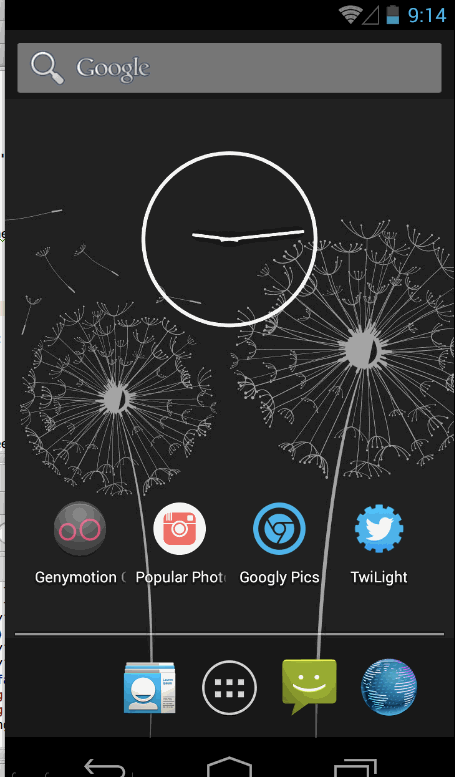

Twilight
=========

Codepath Project: Simple Twitter Client

# Time taken:

### Part 1

4 hours 50 minutes

### Part 2

5 hours 15 minutes

# Completed User Stories

## Required

### Part 1

- [x] User can sign in to Twitter using OAuth login
- User can view the tweets from their home timeline
  - [x] User should be displayed the username, name, and body for each tweet
  - [x] User should be displayed the relative timestamp for each tweet "8m", "7h"
  - [x] User can view more tweets as they scroll with infinite pagination
- User can compose a new tweet
  - [x] User can click a "Compose" icon in the Action Bar on the top right
  - [x] User can then enter a new tweet and post this to twitter
  - [x] User is taken back to home timeline with new tweet visible in timeline

### Part 2

- User can switch between Timeline and Mention views using tabs
  - [x] User can view their home timeline tweets
  - [x] User can view the recent mentions of their username
  - [x] User can scroll to bottom of either of these lists and new tweets will load (infinite pagination)
- User can navigate to view their own profile and see:
  - [x] Picture
  - [x] Tagline
  - [x] # of followers
  - [x] # of following
  - [x] Tweets
- [x] User can click on the profile image in any tweet to see another user's profile and see the same categories as the user profile

## Optional

### Part 1

- Additional UI
  - [ ] Links in tweets are clickable and will launch the web browser
  - [ ] User can see a counter with total number of characters left for tweet
- [ ] User can see embedded image media within the tweet detail view
- Additional Actions
  - [ ] User can refresh tweets timeline by pulling down to refresh
  - [ ] User can tap a tweet to display a "detailed" view of that tweet
  - [ ] User can select "reply" from detail view to respond to a tweet
- Persistence
  - [ ] User can open the twitter app offline and see last loaded tweets. Tweets are persisted into SQLite and acan be displayed from the local DB
- UI Improvements
  - [x] Compose activity is placed with a modal overlay

### Part 2

- Additional UI
  - [ ] User can view followers/following through the profile
  - [x] When a network request is sent, user sees an indeterminate progress indicator
- Additional Actions
  - User can "reply" to any tweet on their home timeline
    - [ ] The user that wrote the original tweet is automatically @ replied in compose
  - [ ] User can click on a tweet to be taken to a "detail view" of that tweet, and take the following actions
    - [ ] Favorite
    - [ ] Unfavorite
    - [ ] Retweet
  - [ ] User can search for tweets matching a particular query and see results
  - [ ] User can view their direct messages
    - [ ] User can send new direct messages
- Robustness
  - [ ] Implement tabs in a gingerbread-compatible approach
  - Robust error handling
    - [ ] Check if internet is available
    - [ ] Handle error cases
    - [ ] Handle network failures
- UI Improvements
  - [ ] Improve the user interface and theme the app to feel "twitter branded"

# Walkthrough of All User Stories

GIF created with [LiceCap](http://www.cockos.com/licecap/).